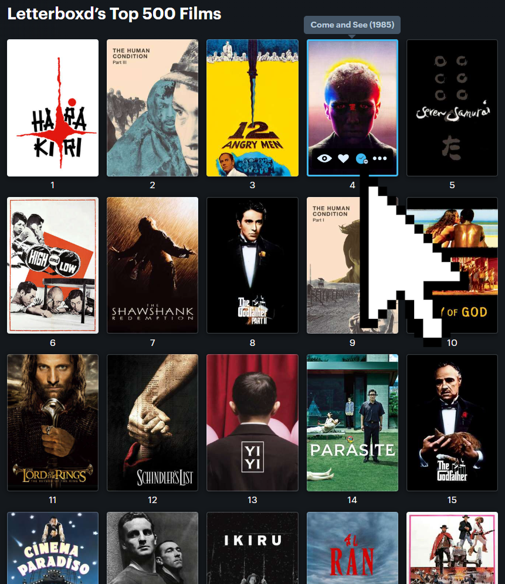

# Letterboxd Watchlist Overlay

A Chrome extension that adds a watchlist toggle button directly on film poster overlays across Letterboxd.

## Features

- One-click watchlist add/remove from any poster
- Syncs with Letterboxd's native watchlist state
- Works on all pages: popular, lists, genre pages, etc.
- Won't appear on very small posters — the overlay needs enough space to fit the button

## Screenshot

## Installation

1. Download or clone this repo
2. Open Chrome and go to `chrome://extensions`
3. Enable **Developer mode** (top right)
4. Click **Load unpacked** and select the extension folder
5. Browse Letterboxd — watchlist buttons appear on poster hover

